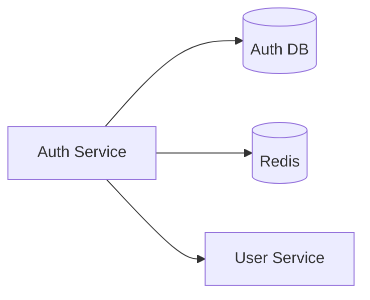
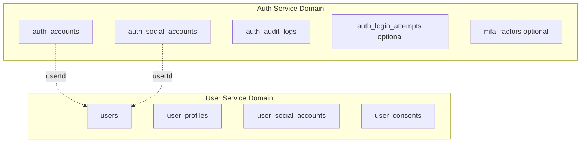
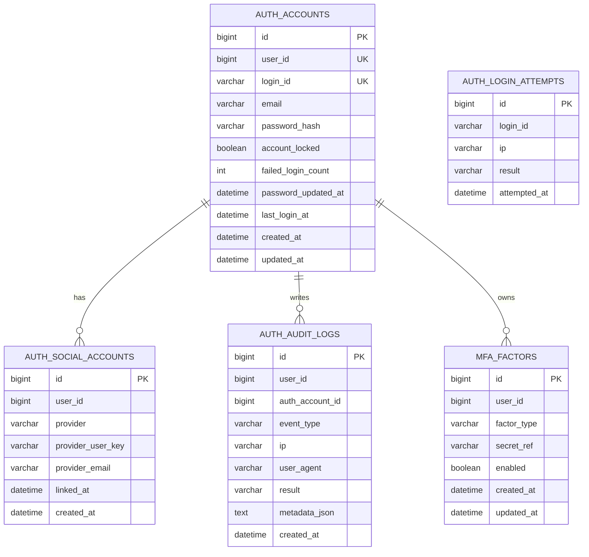
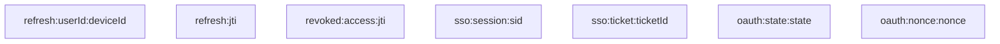
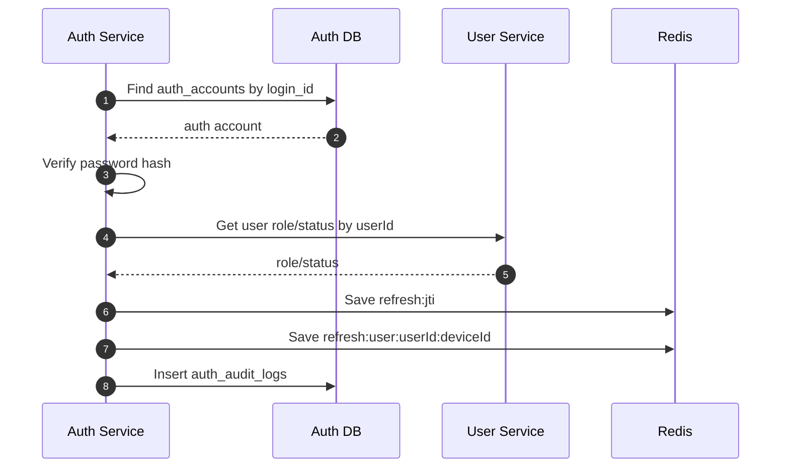
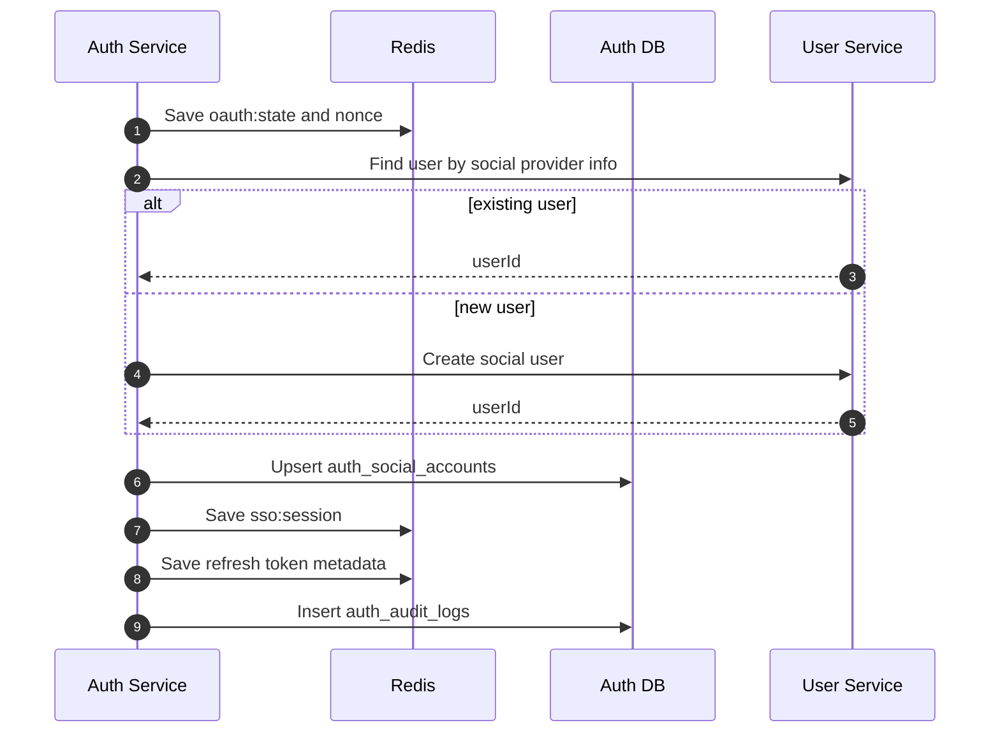
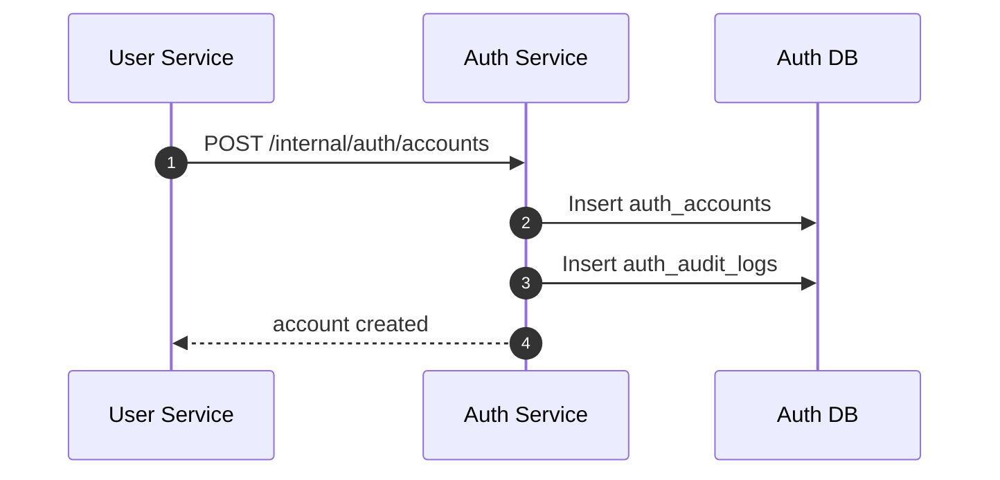

# Auth-service 저장 구조 다이어그램

이 문서는 현재 SSO 구조에서 `auth-service`가 직접 소유해야 하는 저장소 구조를 다이어그램 중심으로 정리한다.

대상 범위:

- `Auth DB`
- `Redis`
- `user-service`와 연결되는 공통 식별자

핵심 원칙:

- `auth-service`는 인증과 토큰 발급의 기준 시스템이다.
- `user-service`는 사용자 도메인의 기준 시스템이다.
- 두 서비스는 `userId`로 연결되며, DB를 직접 공유하지 않는다.

## 1. 저장소 전체 구성

## 2. Auth DB와 User DB의 경계

## 3. Auth DB ER 다이어그램

## 4. 권장 테이블 역할

### 4.1 `auth_accounts`

인증 가능한 계정의 기준 테이블이다.

권장 컬럼:

- `id`
- `user_id`
- `login_id`
- `email`
- `password_hash`
- `account_locked`
- `failed_login_count`
- `password_updated_at`
- `last_login_at`
- `created_at`
- `updated_at`

역할:

- credential 검증의 기준
- 비밀번호 해시 저장
- 잠금 상태와 로그인 실패 횟수 관리

### 4.2 `auth_social_accounts`

OAuth2 provider와 내부 사용자 식별자의 인증 관점 매핑 테이블이다.

권장 컬럼:

- `id`
- `user_id`
- `provider`
- `provider_user_key`
- `provider_email`
- `linked_at`
- `created_at`

역할:

- provider identity와 내부 `userId` 연결
- SSO 로그인 시 기존 사용자 판별

### 4.3 `auth_audit_logs`

인증 보안 이벤트의 감사 로그 테이블이다.

권장 컬럼:

- `id`
- `user_id`
- `auth_account_id`
- `event_type`
- `ip`
- `user_agent`
- `result`
- `metadata_json`
- `created_at`

예시 이벤트:

- `LOGIN_SUCCESS`
- `LOGIN_FAILURE`
- `TOKEN_REFRESH`
- `LOGOUT`
- `PASSWORD_CHANGED`
- `SSO_LOGIN_SUCCESS`

### 4.4 `auth_login_attempts`

로그인 시도 이력을 별도 관리할 경우 사용하는 테이블이다.

역할:

- brute-force 대응
- IP / 계정별 rate limit 분석
- 이상 로그인 탐지

### 4.5 `mfa_factors`

MFA를 도입할 경우 사용하는 선택 테이블이다.

역할:

- TOTP, WebAuthn, SMS 같은 factor 관리

## 5. Redis 저장 구조

`Redis`에는 짧은 수명 또는 세션성 인증 데이터를 둔다.

## 6. Redis 키 역할

### 6.1 refresh token 관련

- `refresh:jti:{jti}`
  - refresh token 메타데이터
  - `userId`, `sid`, `deviceId`, `expiresAt`
- `refresh:user:{userId}:{deviceId}`
  - 사용자와 디바이스 기준 활성 refresh 상태

### 6.2 revoke 관련

- `revoked:access:{jti}`
  - 강제 로그아웃 또는 예외적 access token 폐기 표시

### 6.3 SSO 관련

- `sso:session:{sid}`
  - SSO 인증 세션
  - `userId`, `provider`, `createdAt`, `expiresAt`
- `sso:ticket:{ticketId}`
  - 일회성 교환 ticket

### 6.4 OAuth2 state / nonce

- `oauth:state:{state}`
- `oauth:nonce:{nonce}`

역할:

- CSRF 및 replay 방지

## 7. 로그인 시 저장 흐름

## 8. OAuth2 / SSO 시 저장 흐름

## 9. 회원가입 시 저장 흐름

## 10. 설계 원칙

- `Auth DB`는 `auth-service`만 읽고 쓴다.
- `User DB`는 `user-service`만 읽고 쓴다.
- 두 저장소는 `userId`로만 연결된다.
- refresh token 원문은 가능하면 저장하지 않고 해시 또는 메타데이터를 저장한다.
- Redis 키에는 TTL을 명확하게 둔다.
- 감사 로그는 토큰 저장소와 분리해 보존 정책을 별도로 관리한다.
- `role`, `status`는 필요 시 claim에 담을 수 있지만 기준 값은 `user-service`에 있다.

## 11. 한 줄 정리

- `Auth DB`는 인증 계정과 인증 이벤트를 위한 저장소다.
- `Redis`는 refresh token, revoke 상태, SSO 세션, OAuth2 state를 위한 저장소다.
- `user-service` 데이터는 참조 대상이지 `auth-service`의 직접 저장 대상이 아니다.
