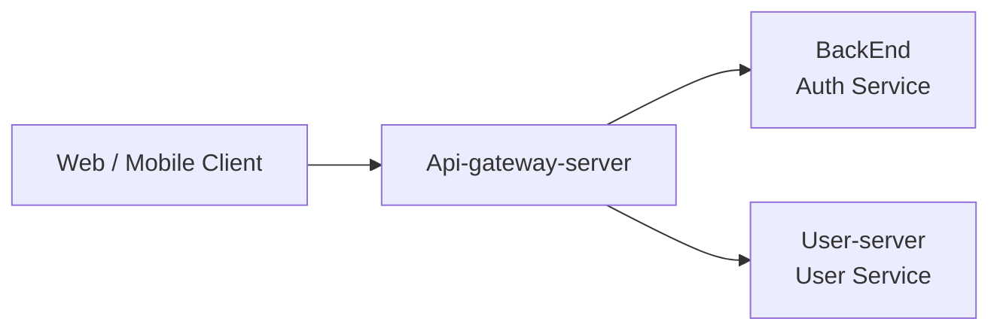
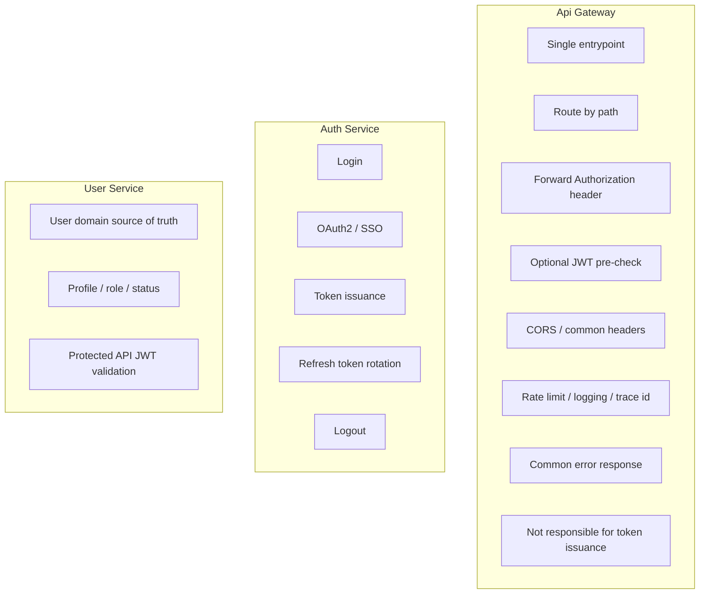
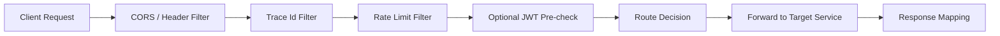
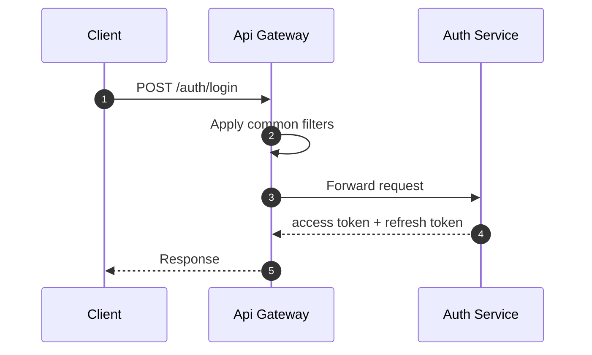
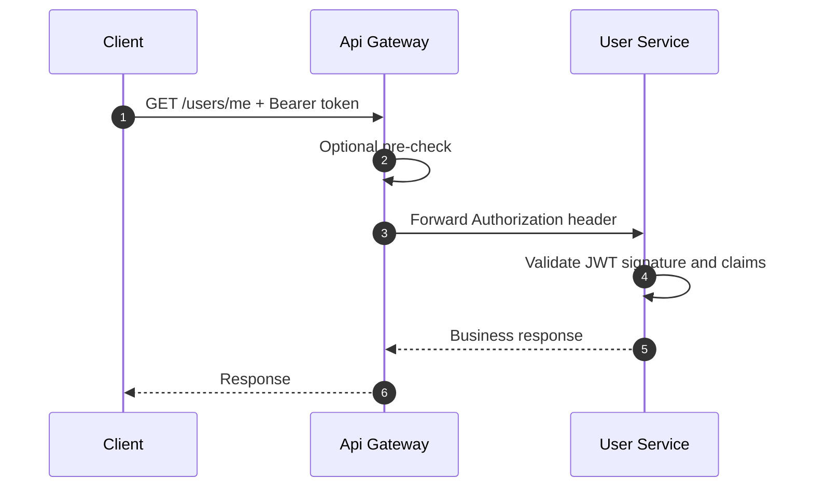
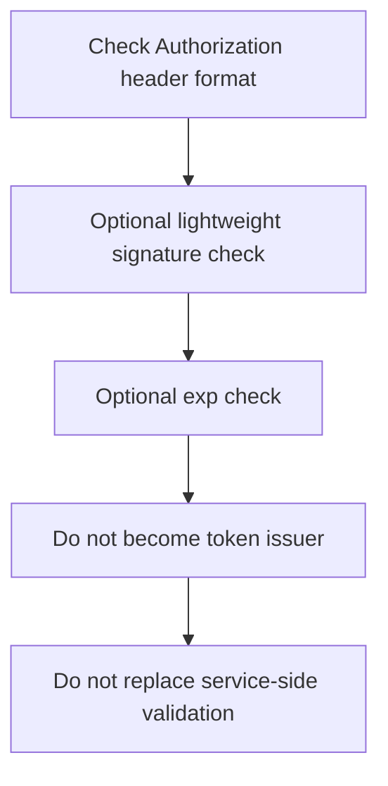
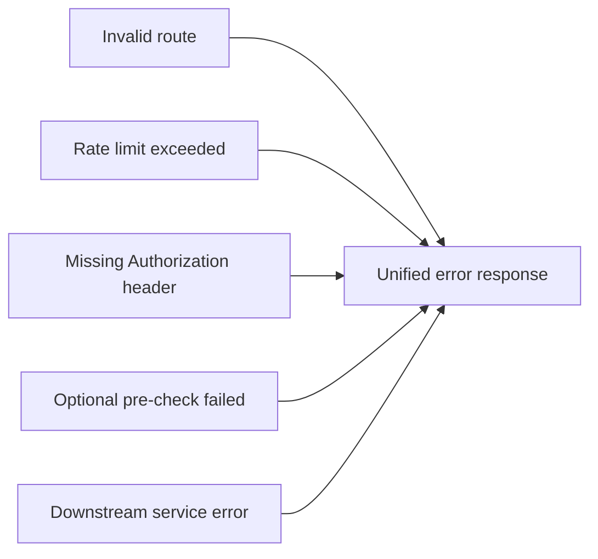
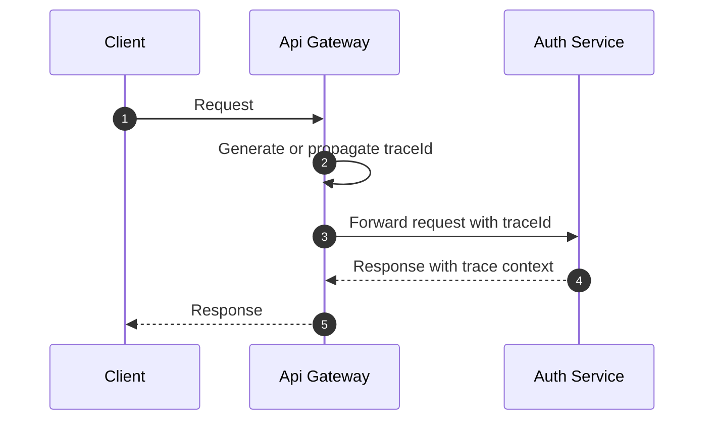

# Gateway 구조 다이어그램

이 문서는 현재 SSO 구조에서 `Api-gateway-server`가 가져야 할 역할, 책임, 비책임, 라우팅 흐름을 다이어그램 중심으로 정리한다.

기준 구조는 아래와 같다.

- `Api-gateway-server`: 외부 요청의 단일 진입점
- `BackEnd`: `auth-service`, 인증과 토큰 발급의 기준 시스템
- `User-server`: `user-service`, 사용자 도메인의 기준 시스템

## 1. Gateway의 역할

`Gateway`의 역할은 "외부 요청을 올바른 내부 서비스로 전달하는 진입 계층"이다.

즉, 클라이언트 요청을 경로에 따라 라우팅하고, 공통 필터를 적용하며, 인증 정보를 전달하는 경계 계층이다.

## 2. Gateway의 책임

- 경로 기반 라우팅
- 공통 필터 적용
- `Authorization` 헤더 전달
- 선택적 JWT 선검증
- 공통 예외 응답 처리
- 로깅, 추적 ID, rate limit
- CORS, 공통 헤더 정책
- 서비스별 prefix 정리와 외부 URL 일관성 유지

## 3. Gateway의 비책임

아래는 `Gateway`가 직접 소유하거나 수행하면 안 되는 일이다.

- 로그인 처리
- 비밀번호 검증
- JWT 발급
- refresh token 발급, rotation, 폐기
- OAuth2 provider 인증 처리
- SSO 세션 기준 저장
- 사용자 도메인 정보 저장
- 사용자 상태나 역할의 기준 판단

위 책임은 각각 `auth-service`와 `user-service`에 둔다.

## 4. 전체 위치



## 5. 책임 경계 다이어그램



## 6. 기본 라우팅 구조

```mermaid
flowchart TB
    IN[Incoming Request]
    P1[/auth/**]
    P2[/users/**]
    P3[/internal/** optional block]
    A[Route to Auth Service]
    U[Route to User Service]
    B[Block external access]

    IN --> P1 --> A
    IN --> P2 --> U
    IN --> P3 --> B
```

## 7. 요청 처리 파이프라인



## 8. 로그인 요청 처리 흐름



## 9. 보호 API 요청 처리 흐름

`Gateway`는 JWT를 선검증할 수 있지만, 최종 검증 책임은 대상 서비스에 있다.



## 10. Gateway에서 JWT 선검증을 둘 때의 원칙



설명:

- `Gateway`의 JWT 선검증은 성능과 공통 오류 응답을 위한 선택 기능이다.
- `User-service`와 `auth-service`는 각자 필요한 최종 검증을 유지해야 한다.

## 11. 에러 처리 구조



## 12. 공통 헤더와 추적 구조



## 13. 권장 구현 원칙

- `Gateway`는 인증의 기준 시스템이 아니다.
- `Gateway`는 토큰을 발급하지 않는다.
- `Gateway`는 토큰을 저장소의 기준 값으로 관리하지 않는다.
- 내부 서비스는 게이트웨이 뒤에 있어도 JWT를 직접 검증한다.
- `Gateway`는 내부 전용 경로를 외부에 노출하지 않는다.
- 공통 보안 헤더와 CORS 정책은 게이트웨이에서 일관되게 적용한다.
- 인증 실패와 라우팅 실패에 대한 응답 형식은 통일한다.
- rate limit과 로깅은 게이트웨이에서 공통 처리하고, 비즈니스 판단은 내부 서비스에서 처리한다.

## 14. 한 줄 정리

- `Gateway`는 "들어오는 요청을 정리하고 전달하는 계층"이다.
- `auth-service`는 "인증하고 토큰을 발급하는 계층"이다.
- `user-service`는 "사용자 도메인의 기준 정보를 소유하는 계층"이다.
