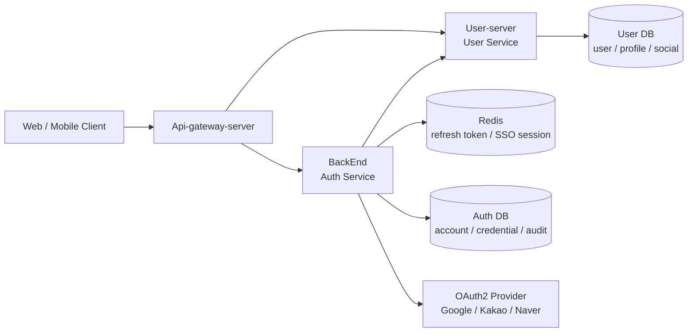
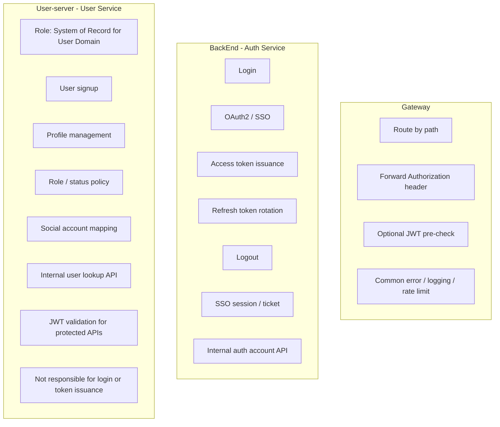
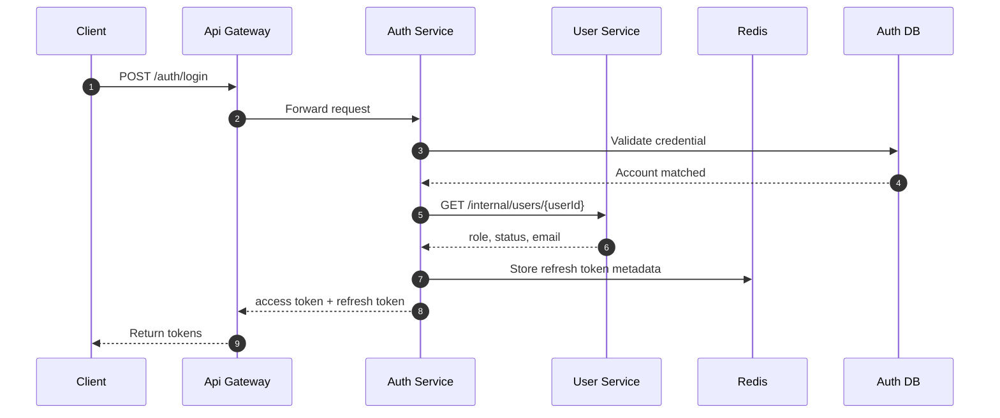
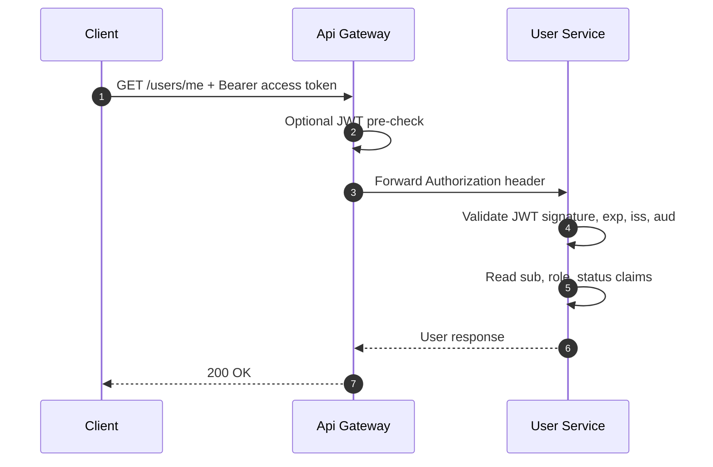
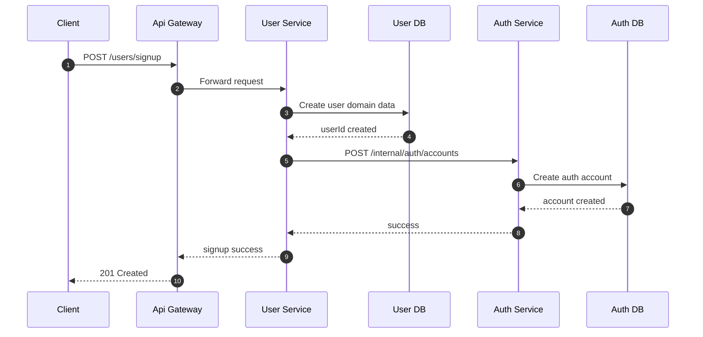
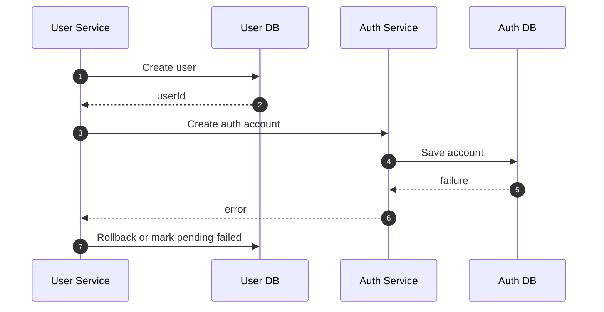
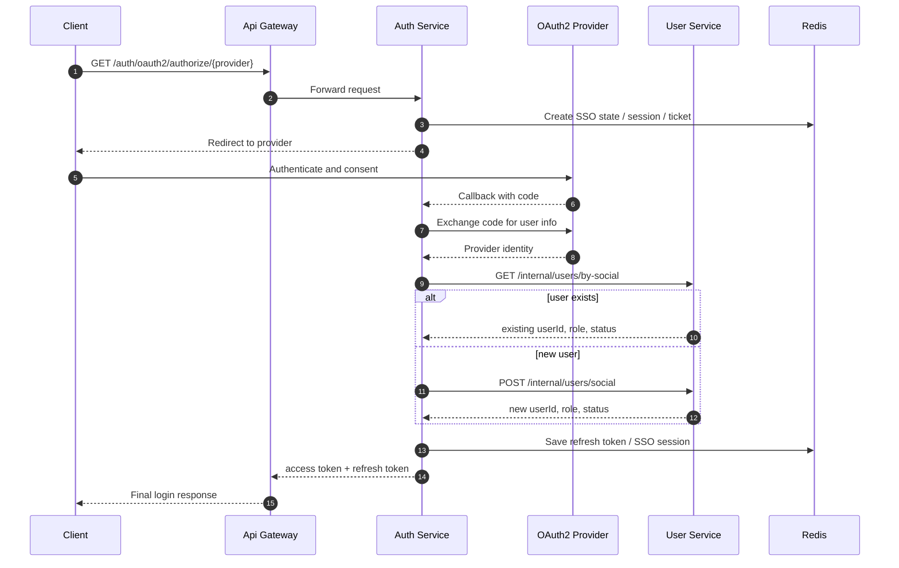
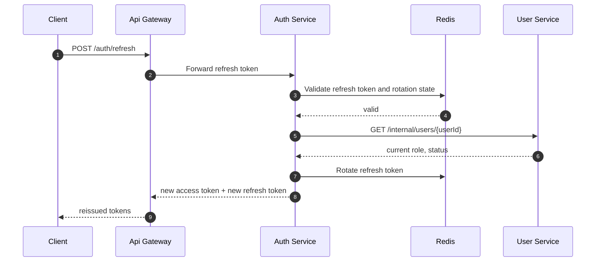
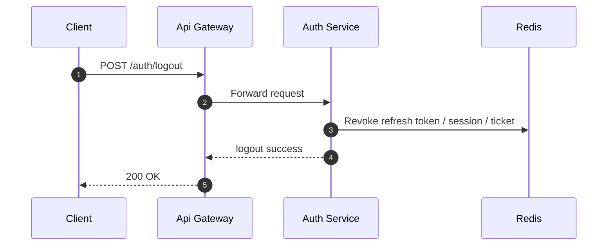
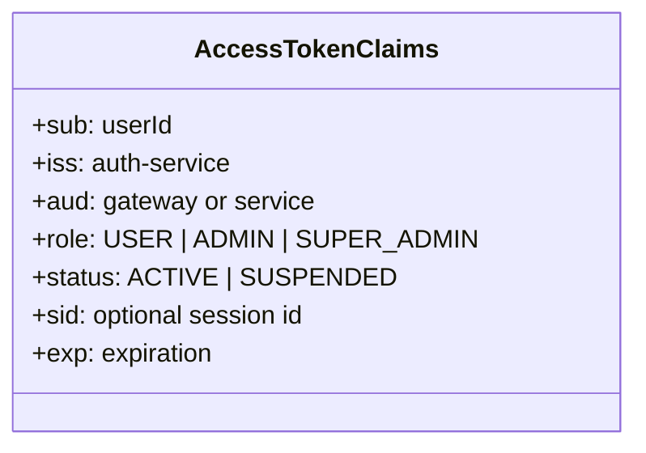

_# SSO 전체 구조 다이어그램

이 문서는 아래 3개 저장소를 기준으로 SSO 구조를 한 번에 볼 수 있도록 정리한다.

- `Api-gateway-server`: 외부 진입점, 라우팅, 공통 필터
- `BackEnd`: `auth-service`, 로그인 / OAuth2 / SSO / JWT 발급
- `User-server`: `user-service`, 사용자 도메인의 기준 시스템

## 1. 전체 아키텍처

## 2. User-service의 역할과 책임

### 2.1 역할

`User-service`의 역할은 "사용자 도메인의 기준 시스템(System of Record)"이다.

즉, 사용자와 관련된 비즈니스 데이터의 최종 기준 저장소이며, 다른 서비스는 사용자 자체를 소유하지 않고 `User-service`를 참조한다.

### 2.2 책임

- 회원 생성과 기본 사용자 정보 관리
- 프로필, 상태, 역할에 대한 비즈니스 규칙 관리
- 소셜 계정 매핑 정보 관리
- `auth-service`가 필요로 하는 사용자 조회용 내부 API 제공
- 사용자 보호 API에서 access token 검증 후 사용자 문맥 구성

### 2.3 책임이 아닌 범위

아래는 `User-service`의 책임이 아니다.

- 로그인 처리
- 비밀번호 검증
- JWT access token 발급
- refresh token 발급, rotation, 폐기
- OAuth2 provider 인증 처리
- SSO 세션 또는 ticket 발급

위 책임은 모두 `Auth-service`에 둔다.

## 3. 역할 기반 책임 분리

## 4. 로그인 흐름

## 5. 사용자 API 호출 흐름

`User-service`는 게이트웨이를 통과한 요청이라도 토큰을 직접 검증해야 한다.

## 6. 회원가입 흐름

외부 회원가입 진입점은 `User-service`로 두고, 인증 계정 생성은 `Auth-service`의 내부 API로 위임한다.

## 7. 회원가입 실패 보상 흐름

## 8. OAuth2 / SSO 로그인 흐름

## 9. Refresh token 재발급 흐름

## 10. 로그아웃 / 세션 종료 흐름

## 11. 권장 JWT Claim

## 12. 구현 원칙

- 토큰 발급은 `Auth-service`만 담당한다.
- `Gateway`는 토큰을 발급하지 않는다.
- `User-service`는 게이트웨이 뒤에 있어도 access token을 직접 검증한다.
- 서비스 간 DB 직접 접근은 금지한다.
- `refresh token`과 SSO 세션은 `Redis`로 관리한다.
- 사용자 상태와 역할 정책은 `User-service`가 소유한다.
- 로그인 시 필요한 최소 사용자 정보만 `User-service`에서 조회하거나 캐시로 동기화한다.
- `User-service`는 사용자 도메인의 기준 시스템이지만, 인증 상태의 기준 시스템은 아니다.

## 13. 서비스별 역할 / 책임 / 비책임

| 서비스 | 역할 | 책임 | 비책임 |
| --- | --- | --- | --- |
| `Api-gateway-server` | 외부 요청의 단일 진입점 | 경로 기반 라우팅, 공통 필터, `Authorization` 헤더 전달, 선택적 JWT 선검증, 공통 예외 처리, 로깅, rate limit | 로그인 처리, 사용자 정보 소유, JWT 발급, refresh token 관리 |
| `BackEnd` (`auth-service`) | 인증과 토큰 발급의 기준 시스템 | 로그인, 비밀번호 검증, OAuth2 / SSO, access token 발급, refresh token rotation, logout, SSO 세션 / ticket 관리, 내부 인증 계정 API 제공 | 프로필 관리, 사용자 도메인 정책 소유, 사용자 상세 정보 저장의 기준 시스템 |
| `User-server` (`user-service`) | 사용자 도메인의 기준 시스템 | 회원 생성, 프로필 관리, 역할 / 상태 정책 관리, 소셜 계정 매핑 관리, 내부 사용자 조회 API 제공, 보호 API에서 JWT 검증 | 로그인 처리, 비밀번호 검증, JWT 발급, refresh token 관리, OAuth2 provider 인증, SSO 세션 관리 |

## 14. 한 줄 정리

- `Gateway`는 "들어오는 요청을 올바른 서비스로 전달하는 계층"이다.
- `Auth-service`는 "누가 누구인지 증명하고 토큰을 발급하는 계층"이다.
- `User-service`는 "사용자 도메인의 기준 정보를 소유하고 관리하는 계층"이다._
